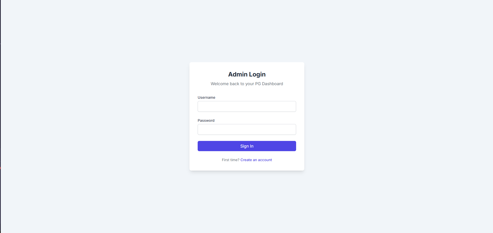
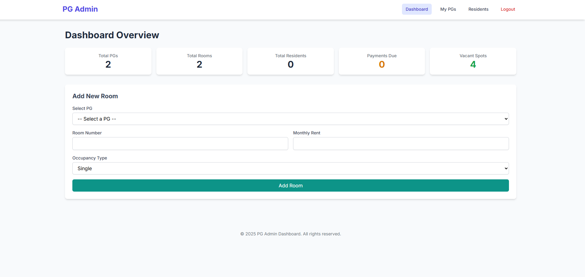
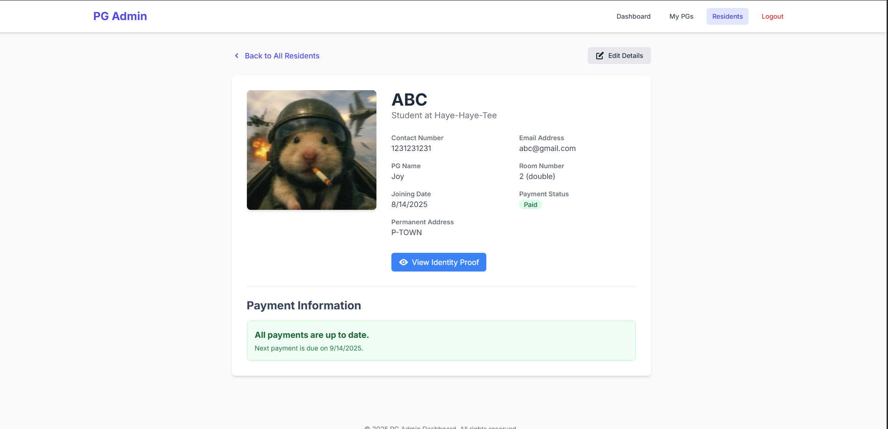

# PG Admin Dashboard: A Multi-Tenant Management Solution

     

Transform your property management with this powerful, custom-built dashboard designed for owners of multiple Paying Guest (PG) accommodations. Go beyond spreadsheets and manage your entire business—from properties and rooms to residents and payments—through a single, secure, and mobile-friendly interface. Built on a robust MEN stack, this application provides a scalable foundation for data-driven property management.

---

### **[► View Live Demo](https://yourhostel.vercel.app)**


---

## Key Features & Data Points

This dashboard empowers you to take full control of your PG business with a comprehensive suite of features.

#### **📊 At-a-Glance Dashboard Overview**
Instantly view the most critical metrics for your entire operation on a centralized dashboard.
- **Total Properties Managed:** `5`
- **Total Rooms Available:** `150`
- **Total Active Residents:** `275`
- **Occupancy Rate:** `91.6%`
- **Residents with Payments Due:** `23`
- **Total Vacant Spots:** `25`

#### **🏢 Multi-Property & Multi-Admin Support**
- **Secure Multi-Admin System:** Allow multiple managers to register and log in.
- **Complete Data Isolation:** Each admin can only view and manage the properties, rooms, and residents they own, ensuring total privacy and security.

#### **🔑 Full CRUD Functionality**
- **Property Management (`/pgs`):**
  - **Create:** Add new PGs with details like name, location, and address.
  - **Read:** View a clean, clickable list of all your properties.
  - **Update:** Edit property details through a dedicated form.
  - **Delete:** Safely delete a PG, which automatically removes all associated rooms, residents, and their cloud-stored images.
- **Room Management (`/pgs/:id`):**
  - **Create:** Add new rooms to a specific PG from the main dashboard.
  - **Read:** View a detailed breakdown of all rooms within a property, including occupant details.
  - **Update:** Edit room details like number, rent, and occupancy type.
  - **Delete:** Delete vacant rooms. A safety check prevents the deletion of occupied rooms.
- **Resident Management (`/residents`):**
  - **Create:** A smart form that only shows vacant rooms in the selected PG.
  - **Read:** A comprehensive list of all residents with quick access to their photos and ID proofs.
  - **Update:** Edit resident personal information.
  - **Delete:** Securely delete resident records and all associated images from the cloud.

#### **💰 Automated Payment Tracking**
- **Automatic Due Status:** A daily automated job (`node-cron`) checks and updates payment statuses from "Paid" to "Due" at the start of each new billing cycle.
- **Pending Amount Calculation:** Automatically calculates and displays the total outstanding balance for any resident with a "Due" status.
- **One-Click Payment Settlement:** A "Mark as Paid" button instantly settles dues and advances the next payment date.

#### **📱 Modern Tech Stack & Mobile-First Design**
- **Cloud Image Storage:** Securely handles resident photos and ID proofs with Cloudinary.
- **Server-Side Validation:** Robust data validation with Joi before any data is saved.
- **Mobile-Friendly UI:** A fully responsive interface built with Tailwind CSS, ensuring a seamless experience on any device.

## Screenshots

*Replace these placeholders with your actual screenshots.*

| Login Page | Dashboard | Resident Detail View |
| :---: | :---: | :---: |
|  |  |  |


## Setup and Installation

Follow these steps to get the project running on your local machine.

#### 1. Clone the Repository
```bash
git clone [https://github.com/Mehul-Agarwaal/ToppersPG.git](https://github.com/Mehul-Agarwaal/ToppersPG.git)
cd ToppersPG
```
#### 2. Install dependencies
```bash
npm install
```
#### Set Up Environment Variables
**Create a file named .env in the root of your project. Copy the contents of .env.example and fill in your credentials.**
```bash
MONGO_URI=your_mongodb_atlas_connection_string
CLOUDINARY_CLOUD_NAME=your_cloudinary_cloud_name
CLOUDINARY_API_KEY=your_cloudinary_api_key
CLOUDINARY_API_SECRET=your_cloudinary_api_secret
SESSION_SECRET=a_long_random_secure_string
PORT=3000
```
#### 4. Run The Application
**For development with automatic server restarts:**
```bash
nodemon server.js
```
